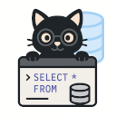

<p align="center">
  
</p>

<h1 align="center">QueryCat</h1>

<p align="center">
<strong>Query CSV, JSON, XML and log files with plain SQL - right from your terminal!</strong>
</p>

<p align="center">
  <a href="https://github.com/krasninja/querycat/actions/workflows/run-tests.yaml"></a>
  <a href="https://github.com/krasninja/querycat/releases/latest"></a>
  <a href="https://www.nuget.org/packages/QueryCat/"></a>
  <a href="https://github.com/krasninja/querycat/releases"></a>
  <a href="LICENSE.txt"></a>
</p>

<p align="center">
  <a href="#installation">Installation</a> |
  <a href="#in-action">Examples</a> |
  <a href="https://querycat.readthedocs.io/en/latest/tutorial/">Tutorial</a> |
  <a href="https://querycat.readthedocs.io/">Documentation</a> |
  <a href="https://querycat.anti-soft.ru/playground/">Playground</a>
</p>

```console
$ ps -ef | qcat "SELECT UID, COUNT(*) cnt FROM - GROUP BY UID ORDER BY cnt DESC LIMIT 3"
| UID        | cnt   |
| ---------- | ----- |
| root       | 256   |
| ivan       | 93    |
| systemd+   | 1     |
```

QueryCat is a command line tool that lets you use SQL to query CSV, JSON, XML and log files - or the output of any other command. No need to import your data into Excel or a database first: point QueryCat at a file or pipe and query it as is.

- **Single binary, zero dependencies.** Natively compiled - download it and run it.
- **Streaming pipeline.** Rows are processed as they are read, so large files don't have to fit in memory.
- **Read and write.** `INTO` converts the result into another format: CSV in, JSON out.
- **Embeddable.** Use it as a .NET library to query files or your own objects.

## Features

- **Inputs:** [CSV](https://querycat.readthedocs.io/en/latest/input/csv/), [TSV](https://querycat.readthedocs.io/en/latest/input/tsv/), [JSON](https://querycat.readthedocs.io/en/latest/input/json/), [XML](https://querycat.readthedocs.io/en/latest/input/xml/), [LTSV](https://querycat.readthedocs.io/en/latest/input/ltsv/), [IIS W3C](https://querycat.readthedocs.io/en/latest/input/iisw3c/), [CLEF](https://querycat.readthedocs.io/en/latest/input/clef/) logs, plain text, stdin and more via [plugins](https://querycat.readthedocs.io/en/latest/plugins/).
- **SQL:** filtering, [aggregates](https://querycat.readthedocs.io/en/latest/functions/aggregate/) and `GROUP BY`, joins, `ORDER BY`, `LIMIT`/`OFFSET`, `UNION`, subqueries, CTEs (including recursive), window functions.
- **Parsing helpers:** JSONPath, XPath, [regex](https://querycat.readthedocs.io/en/latest/input/regex/) and [Grok](https://querycat.readthedocs.io/en/latest/input/grok/) patterns.
- **Outputs:** text table, CSV, TSV, JSON, XML.
- **Scripting:** [variables](https://querycat.readthedocs.io/en/latest/commands/declare/), `IF`, `INSERT`, `UPDATE`, `DELETE`.
- **Web UI, REST API** and a simple file server with partial request support - see [web server](https://querycat.readthedocs.io/en/latest/features/web-server/).
- **.NET library:** query .NET objects in your app; [AOT](https://learn.microsoft.com/en-us/dotnet/core/deploying/native-aot) friendly.

## Installation

### Prebuilt Binary

Grab the single binary for your platform from the [latest release](https://github.com/krasninja/querycat/releases/latest), unpack it and run - no runtime or dependencies required. Builds are published for Linux (x64/arm64), macOS (x64/arm64) and Windows (x64).

```bash
# Example for Linux x64. Use the current version from the releases page
# and the archive for your platform (linux-arm64, osx-x64, osx-arm64, win-x64).
VERSION=X.Y.Z
curl -LO https://github.com/krasninja/querycat/releases/download/v$VERSION/qcat-$VERSION-linux-x64.tar.gz
tar -xzf qcat-$VERSION-linux-x64.tar.gz
./qcat --version
```

### Arch Linux

QueryCat is available in the [AUR](https://aur.archlinux.org/packages/querycat-bin). Install it with your AUR helper, for example:

```bash
yay -S querycat-bin
```

### .NET

Prefer .NET? Install it as a [NuGet package](#use-as-a-net-library) instead.

## In Action

Find the most failing endpoints in a JSON log.

```console
$ qcat "SELECT url, COUNT(*) AS cnt, MAX(\"time\") AS last_seen FROM 'app-log.json' WHERE level = 'error' GROUP BY url ORDER BY cnt DESC"
| url         | cnt   | last_seen           |
| ----------- | ----- | ------------------- |
| /api/orders | 2     | 03/30/2026 13:35:02 |
| /api/login  | 1     | 03/30/2026 13:36:40 |
```

Convert CSV to JSON while aggregating it.

```console
$ qcat "SELECT dept, AVG(salary) AS avg_salary INTO 'by-dept.json' FROM 'employees.csv' GROUP BY dept"
$ cat by-dept.json
[{"dept":"IT","avg_salary":5000},{"dept":"Sales","avg_salary":4000}]
```

Rank rows within groups using window functions.

```console
$ qcat "SELECT name, dept, salary, row_number() OVER (PARTITION BY dept ORDER BY salary DESC) AS pos FROM 'employees.csv'"
| name       | dept       | salary | pos   |
| ---------- | ---------- | ------ | ----- |
| Anna       | IT         | 5200   | 1     |
| Boris      | IT         | 4800   | 2     |
| Clara      | Sales      | 3900   | 2     |
| Dmitry     | Sales      | 4100   | 1     |
```

Calculate the total files size per user in a directory.

```console
$ find /tmp -ls 2>/dev/null | qcat "SELECT column4 as user, size_pretty(SUM(column6)) size FROM - GROUP BY column4"
| user       | size       |
| ---------- | ---------- |
| root       | 56.1 K     |
| ivan       | 252.6 M    |
```

Show the full user name for each process by joining `ps` output with `/etc/passwd`.

```console
$ ps aux | qcat "SELECT psw.column4 AS full_name, ps.PID, ps.COMMAND FROM - AS ps JOIN '/etc/passwd' FORMAT csv(delimiter=>':', has_header=>false) AS psw ON ps.USER = psw.column0 LIMIT 3"
| full_name  | ps.PID | ps.COMMAND               |
| ---------- | ------ | ------------------------ |
| Super User | 1      | /usr/lib/systemd/systemd |
| Super User | 2      | [kthreadd]               |
| Super User | 3      | [pool_workqueue_release] |
```

Pass a file as a variable.

```console
$ qcat --var csv=./numbers.csv "SELECT a + b FROM csv"
3
7
```

More examples are in the [tutorial](https://querycat.readthedocs.io/en/latest/tutorial/), or try queries online in the [playground](https://querycat.anti-soft.ru/playground/).

## Use as a .NET Library

QueryCat is also available as a NuGet package, so you can run SQL over files and your own .NET objects from your application. See the [SDK](https://querycat.readthedocs.io/en/latest/development/sdk/) section in the docs.

```bash
dotnet add package QueryCat
```

## Limitations

- Not the whole SQL standard is implemented.
- Only a limited number of row sources support `INSERT` and `UPDATE` commands.

## Links

- [Documentation](https://querycat.readthedocs.io/) and [tutorial](https://querycat.readthedocs.io/en/latest/tutorial/)
- [Playground](https://querycat.anti-soft.ru/playground/)
- [NuGet package](https://www.nuget.org/packages/QueryCat/)
- [Changelog](CHANGELOG.md)
- [Alternatives](https://querycat.readthedocs.io/en/latest/misc/alternatives/) - other tools that do similar things

## Contributing

Issues and pull requests are welcome! See [CONTRIBUTING.md](CONTRIBUTING.md) for how to build the project and run tests. Please target the `develop` branch.

## License

QueryCat is licensed under the MIT License - see the [LICENSE](LICENSE.txt) file for details.
