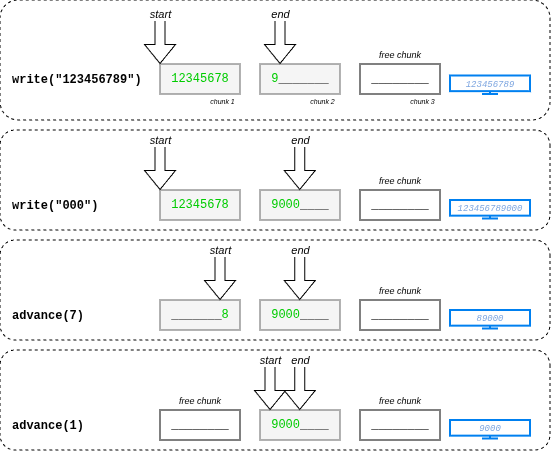

# Internal Classes

The document describes internal and public classes that might be used separately from the project.

## `AsyncLock`

A mutual exclusion lock that is compatible with async. This lock supports recursive calls.

Example:

```csharp
AsyncLock asyncLock = new();
try
{
    var @lock = await asyncLock.LockAsync();
}
finally
{
    await @lock.DisposeAsync();
}
```

## `AsyncUtils`

Helpers for asynchronous operations.

```csharp
AsyncUtils.RunSync(ct => _client.OperationAsync(ct));
```

```csharp
var items = new List<CompletionResult>();
IAsyncEnumerable<CompletionResult> result = AsyncUtils.ToAsyncEnumerable(items);
```

## `DynamicBuffer`

The class encapsulates the linked list of buffers. It keeps the ordered list of buffers and can auto-grow if no enough space available. Also, it keeps freed buffers for reuse. The class is not thread safe.

```csharp
var dynamicBuffer = new DynamicBuffer<char>(chunkSize: 8);
dynamicBuffer.Write("123456789");
var span1 = dynamicBuffer.GetSequence(); // 123456789
dynamicBuffer.Write("000");
dynamicBuffer.Advance(7);
var span2 = dynamicBuffer.GetSequence(); // 89000
```



## `Tracer`

Simple tracer to measure execution time. Measures time between StartMethod and EndMethod calls.

```csharp
Tracer.File = @"Q:\1.log";
Tracer.StartMethod(nameof(MyMethod));
Tracer.EndMethod(nameof(MyMethod));
```

```
[12/8/2025 10:47:25 AM] METHOD: MyClass.MyMethod : 00:00:01.1347214
```
